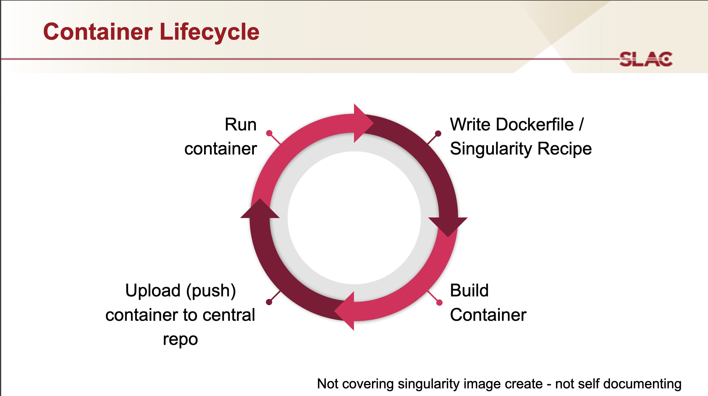

# Working in containers

It is often challenging and/or time-consuming to install a piece of software on a given machine. And once successful, to realize one has to do it all over again on a new machine...

Containers offer a solution to that problem in that you only need to figure out how to install the software once for a given OS, write the steps in a "recipe" and you can then ship the resulting image to any machine, and instantly run - no further installation required.

As shown in the diagram below, the process can be described in 5 steps:
- Write the recipe.
- Build the image using the recipe.
- Push the image in the cloud.
- Pull the image on the machine of interest.
- Run or execute the container.

We go through these steps below.


courtesy of [Yee-Ting Li](https://profiles.stanford.edu/yee-ting-li)

## Building containers and running images.

We will use two popular tools to go through the containerization process: Docker and Singularity.
They are essentially doing the same things but each offer a set of features that makes using the combination enticing.
The workflow described below is one way to do things - keep in mind that other approaches are possible.

### The recipe

The way one writes a recipe will not be exactly the same if writing it for Docker or Singularity, but the basic idea will be the same.
Let's look at an example of a Docker recipe (a.k.a a `Dockerfile`) that we use to build the image for running TEM simulator, and comment on each step of the file.

We start the Dockerfile by stating that we will build our image on top of a pre-existing image which has installed the OS Ubuntu:18.04. Any software that we will install later needs to be compatible with this OS. But the machine on which we will run the container needs not have this OS installed - that's one of the perks of containerization.
```dockerfile
FROM ubuntu:18.04
```

We then define the "working directory" of the container, where all Docker commands will be executed.

```dockerfile
WORKDIR /work
```

We are now ready to go through the various installation steps necessary, using the Docker `RUN` command. Note that since we are starting from a bare Ubuntu OS, we have to install all the tools that we use, even things like `wget` or `unzip`.

```dockerfile
RUN apt-get update && \
    apt-get install -y git wget unzip build-essential

RUN wget 'http://www.fftw.org/fftw-3.3.10.tar.gz' && \
    tar -xzvf fftw-3.3.10.tar.gz  && \
    cd fftw-3.3.10 && ./configure && make && make install && \
    cd /work && rm -rf fftw-3.3.10*

RUN wget 'https://iweb.dl.sourceforge.net/project/tem-simulator/TEM-simulator_1.3.zip' && \
    unzip TEM-simulator_1.3.zip && \
    cd TEM-simulator_1.3/src && make && \
    cd /work && rm -f TEM-simulator_1.3.zip
```

Finally, we use the Docker `ENV` command to add the path to the TEM simulator exectutable into the `$PATH`.

```dockerfile
ENV PATH=/work/TEM-simulator/src:$PATH
```

### Build, push and pull the image

Now that we have our recipe, we are ready to build our image from it.

Assuming you have `docker` installed on your machine, and you have created a [DockerHub](https://hub.docker.com/) account, the basic commands for this would be:
```bash
docker build <your-docker-username>/<the-image-name>:<the-tag-for-this-build>
docker push <your-docker-username>/<the-image-name>:<the-tag-for-this-build>
```
In our simSPI repo, we take advantage of GitHub Actions workflows to carry those steps for us - so no need to have `docker` on your local machine, the `build` and `push` steps are carried out in the cloud.

In both cases, the end result is your image now being available online at a URL that looks like this: https://hub.docker.com/repository/docker/<your-docker-username>/<the-image-name>.

At this point, we have "built" and "pushed" an "image" to the "cloud". For you to use it, the next steps are to "pull" it and "run" it as a container. If you have a Linux machine handy, you could install Singularity and do the following:

```bash
singularity pull docker://<your-user-name>/<the-image-name>:latest
```

This would "pull" the Docker image from the cloud and convert it to a Singularity image: a `<the-image-name>_latest.sif` file.

### Run the container

You are now equipped with an image that you can run as a container - what does this mean? It means you can "execute" the container and work in it as if you were accessing a different computer.

Say you do this in a Terminal window on your Linux machine:

```bash
singularity exec <the-image-name>_latest.sif /bin/bash
```
This will just appear as a regular Terminal bash line (starting with Singularity>) but now you can run TEM simulator since you are in the container where it is installed.

## Additional resources about containers

-
- Yee-Ting Li (SLAC) [seminar](https://confluence.slac.stanford.edu/display/AI/AI+Seminar#AISeminar-Containers!Containers!Containers!)